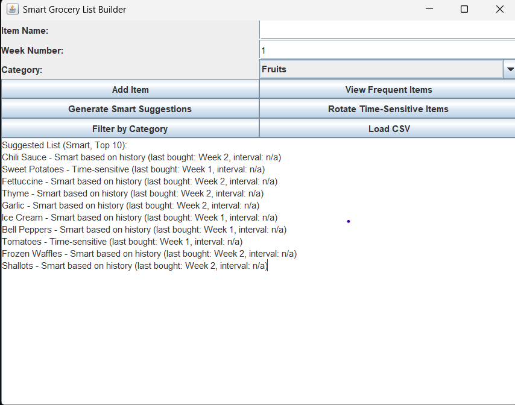

# Smart Grocery List Builder

A Java application that helps users track and manage their grocery shopping habits over time. The application analyzes purchase patterns to intelligently suggest items for your next shopping trip based on your buying history. It identifies time-sensitive items (like fresh produce and dairy) and reminds you when they might need to be repurchased.

## Features

- Track grocery purchases by week
- Categorize items (Fruits, Vegetables, Dairy, etc.)
- Automatically identify time-sensitive items
- Generate smart shopping recommendations based on purchase patterns
- View purchase history by week or category
- Import grocery data from CSV files
- Simple GUI interface for easy interaction

## Usage

### Running the Application

Launch the application by running the `GroceryListGUI` class. This opens the main application window where you can:

- Add new grocery items
- View frequently purchased items
- Generate smart shopping suggestions
- Filter items by category
- Import grocery data from CSV files

### Adding Items Manually

1. Enter the item name in the "Item Name" field
2. Enter the week number in the "Week Number" field
3. Select a category from the dropdown menu
4. Click the "Add Item" button

### Loading Data from CSV

Click the "Load CSV" button and select a CSV file with the following format:

Item, Week, Category
Milk, 1, Dairy
Apple, 1, Fruit
Bread, 2, Grains

## API Documentation

### GroceryListBuilder Interface

The core interface for the application, defining essential methods:

#### `void addItem(String item, int week)`
- **Description**: Adds an item to the grocery list for a given week
- **Parameters**:
  - `item`: The item to be added
  - `week`: The week number for the item
- **Example**: `builder.addItem("Milk", 3)` - Adds "Milk" to week 3

#### `List<String> getFrequentItems()`
- **Description**: Returns the most frequently bought items (top 10)
- **Returns**: List of frequent items
- **Example**: `builder.getFrequentItems()` - Returns items like ["Milk", "Bread", "Eggs"]

#### `List<String> generateSuggestedList()`
- **Description**: Generates a smart suggested list for the next shopping trip
- **Returns**: List of suggested items
- **Example**: `builder.generateSuggestedList()` - Might return ["Milk", "Bananas", "Eggs"]

#### `void rotateItems(int currentWeek)`
- **Description**: Rotates time-sensitive items based on purchase patterns
- **Parameters**:
  - `currentWeek`: The current week number
- **Example**: `builder.rotateItems(6)` - Checks items from week 4 that might need repurchasing

### GroceryListBuilderImpl Class

An enhanced implementation of the GroceryListBuilder interface with additional methods:

#### `GroceryListBuilderImpl()`
- **Description**: Constructor to initialize the GroceryListBuilder
- **Example**: `GroceryListBuilderImpl builder = new GroceryListBuilderImpl()`

#### `void addCategory(String item, String category)`
- **Description**: Adds a category to an item
- **Parameters**:
  - `item`: The grocery item
  - `category`: The category to assign
- **Example**: `builder.addCategory("Milk", "Dairy")`

#### `String getItemCategory(String item)`
- **Description**: Gets the category of an item
- **Parameters**:
  - `item`: The grocery item
- **Returns**: The category of the item, or null if not categorized
- **Example**: `builder.getItemCategory("Milk")` - Returns "Dairy"

#### `List<String> getItemsByCategory(String category)`
- **Description**: Gets all items in a specific category
- **Parameters**:
  - `category`: The category to filter by
- **Returns**: List of items in the category
- **Example**: `builder.getItemsByCategory("Fruits")` - Returns ["Apples", "Bananas"]

#### `void markAsTimeSensitive(String item)`
- **Description**: Marks an item as time-sensitive
- **Parameters**:
  - `item`: The item to mark as time-sensitive
- **Example**: `builder.markAsTimeSensitive("Milk")`

#### `void unmarkAsTimeSensitive(String item)`
- **Description**: Removes an item from the time-sensitive set
- **Parameters**:
  - `item`: The item to unmark as time-sensitive
- **Example**: `builder.unmarkAsTimeSensitive("Canned Beans")`

#### `boolean isTimeSensitive(String item)`
- **Description**: Checks if an item is time-sensitive
- **Parameters**:
  - `item`: The item to check
- **Returns**: `true` if the item is time-sensitive, `false` otherwise
- **Example**: `builder.isTimeSensitive("Milk")` - Returns `true`

#### `List<String> getWeeklyItems(int week)`
- **Description**: Gets all items purchased in a specific week
- **Parameters**:
  - `week`: The week number
- **Returns**: List of items purchased in that week
- **Example**: `builder.getWeeklyItems(3)` - Returns items bought in week 3

#### `Set<String> getAllCategories()`
- **Description**: Gets all available categories
- **Returns**: Set of all categories
- **Example**: `builder.getAllCategories()` - Returns ["Fruits", "Dairy", "Grains", ...]

#### `Set<Integer> getAllWeeks()`
- **Description**: Gets all week numbers that have grocery data
- **Returns**: Set of week numbers
- **Example**: `builder.getAllWeeks()` - Returns [1, 2, 3, 5]

#### `int getCurrentWeek()`
- **Description**: Gets the current week
- **Returns**: The current week number
- **Example**: `builder.getCurrentWeek()` - Returns 5

#### `void setCurrentWeek(int week)`
- **Description**: Sets the current week
- **Parameters**:
  - `week`: The week number to set
- **Example**: `builder.setCurrentWeek(6)`

#### `double getAveragePurchaseInterval(String item)`
- **Description**: Calculates the average purchase interval for an item
- **Parameters**:
  - `item`: The item to calculate for
- **Returns**: The average interval between purchases, or -1 if insufficient data
- **Example**: `builder.getAveragePurchaseInterval("Milk")` - Returns 2.5 (weeks)

#### `int getLastPurchaseWeek(String item)`
- **Description**: Gets the week when an item was last purchased
- **Parameters**:
  - `item`: The item to check
- **Returns**: The week number, or -1 if not found
- **Example**: `builder.getLastPurchaseWeek("Bread")` - Returns 4

### Item Class

Represents a grocery item with its properties:

#### `Item(String name, String category, boolean timeSensitive)`
- **Description**: Constructor for creating a grocery item
- **Parameters**:
  - `name`: The name of the item
  - `category`: The category the item belongs to
  - `timeSensitive`: Whether the item is time-sensitive
- **Example**: `Item milk = new Item("Milk", "Dairy", true)`

#### `Item(String name)`
- **Description**: Constructor with default values (category="Uncategorized", timeSensitive=false)
- **Parameters**:
  - `name`: The name of the item
- **Example**: `Item uncategorizedItem = new Item("Paper Towels")`

#### Standard getters and setters
- `getName()`, `setName(String name)`
- `getCategory()`, `setCategory(String category)` 
- `isTimeSensitive()`, `setTimeSensitive(boolean timeSensitive)`
- `getLastPurchasedWeek()`, `setLastPurchasedWeek(int week)`

## CSV Data Format

The application supports importing data from CSV files with the following format:

Item,Week,Category
Milk,1,Dairy
Bread,1,Grains
Eggs,1,Dairy
Apples,2,Fruits
Chicken,2,Meat